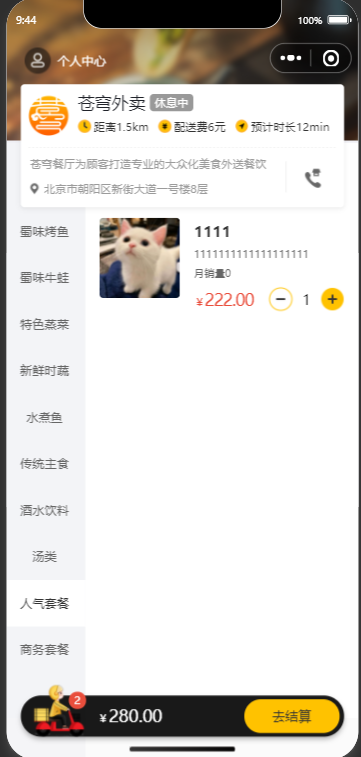
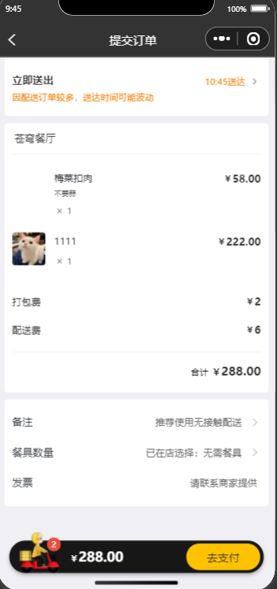
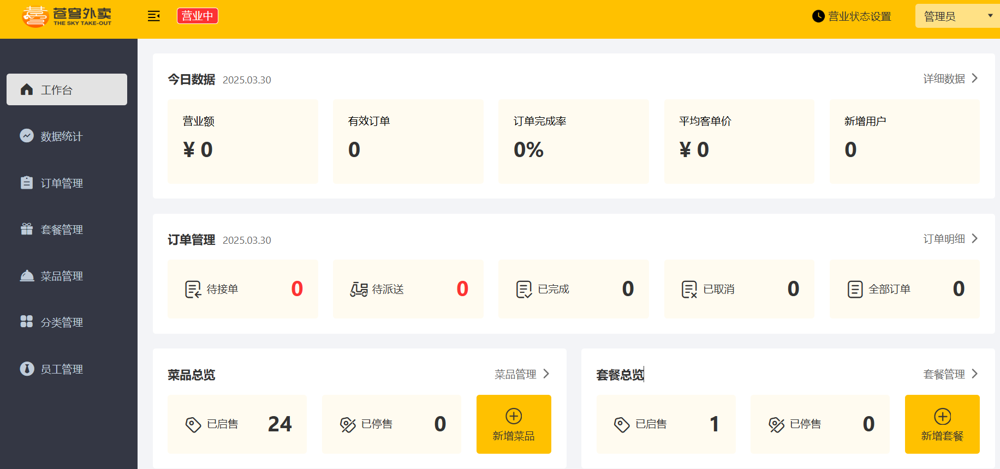
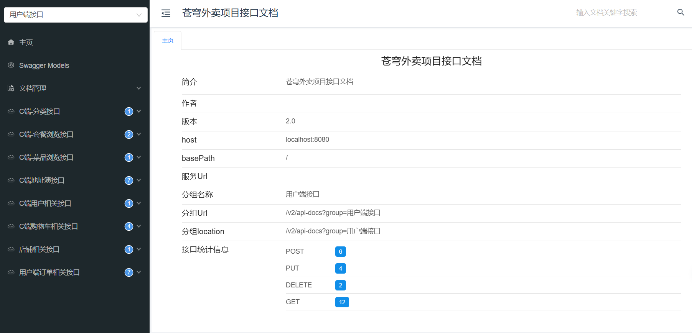

# Sky Delivery Project README

## Introduction
The `sky-delivery` project is a Java-based food delivery system. It uses Spring Boot as the backend framework, MyBatis for data persistence, Redis for caching, and provides a comprehensive set of features for both customers and administrators.

## Project Structure
The project adopts a Maven multi-module structure, mainly including the following modules:
- **sky-common**: Contains common utility classes, constants, and exception classes used across the project.
- **sky-pojo**: Holds entity classes (Entity), Data Transfer Objects (DTO), and View Objects (VO) for data transfer between different layers.
- **sky-server**: The core service module, which includes controllers, service layers, and data access layers, responsible for handling business logic and interacting with the database.

## Function Modules

### 1. Customer-side Features
- **Login and Registration**: Supports user login using WeChat and retrieves user information.
- **Shopping Cart Management**: Users can add items to the cart, view the cart contents, clear the cart, and remove individual items.
- **Order Management**: Users can place orders, pay for orders, query order history, view order details, cancel orders, reorder, and request order reminders.
- **Store Information Query**: Users can check the business status of the store.



### 2. Admin-side Features
- **Employee Management**: Administrators can add, modify, and delete employee information. Employees can log in and perform corresponding operations.
- **Setmeal Management**: Administrators can add, modify, and delete setmeals, query setmeal lists, and start or stop setmeal sales.
- **Order Management**: Administrators can search for orders, count orders in different statuses, view order details, accept orders, reject orders, cancel orders, dispatch orders, and complete orders.
- **Store Management**: Administrators can set and check the business status of the store.
- **Data Statistics**: Provides turnover statistics, user statistics, order statistics, top 10 sales rankings, and the ability to export operational data reports.
- **Workbench**: Allows querying of today's data, order management data, dish overview, and setmeal overview.
  
- 
## Technology Stack
- **Backend Framework**: Spring Boot
- **Data Persistence**: MyBatis
- **Caching**: Redis
- **Message Queue**: None
- **Interface Documentation**: Swagger + Knife4j
- **Payment**: WeChat Pay
- **File Storage**: Alibaba Cloud OSS

## Environment Configuration

### 1. Database Configuration
Configure the database connection information in `sky-server/src/main/resources/application.yml`:
```yaml
spring:
  datasource:
    druid:
      driver-class-name: ${sky.datasource.driver-class-name}
      url: jdbc:mysql://${sky.datasource.host}:${sky.datasource.port}/${sky.datasource.database}?serverTimezone=Asia/Shanghai&useUnicode=true&characterEncoding=utf-8&zeroDateTimeBehavior=convertToNull&useSSL=false&allowPublicKeyRetrieval=true
      username: ${sky.datasource.username}
      password: ${sky.datasource.password}
```
Configure the database information for the development environment in `sky-server/src/main/resources/application-dev.yml`:
```yaml
sky:
  datasource:
    driver-class-name: com.mysql.cj.jdbc.Driver
    host: localhost
    port: 3307
    database: sky_take_out
    username: root
    password: root
```

### 2. Redis Configuration
Configure the Redis connection information in `sky-server/src/main/resources/application.yml`:
```yaml
spring:
  redis:
    host: ${sky.redis.host}
    port: ${sky.redis.port}
    password: ${sky.redis.password}
    database: ${sky.redis.database}
```
Configure the Redis information for the development environment in `sky-server/src/main/resources/application-dev.yml`:
```yaml
sky:
  redis:
    host: localhost
    port: 6379
    password: 123456
    database: 10
```

### 3. WeChat Pay Configuration
Configure the WeChat Pay related information in `sky-server/src/main/resources/application.yml`:
```yaml
sky:
  wechat:
    appid: ${sky.wechat.appid}
    secret: ${sky.wechat.secret}
    mchid : ${sky.wechat.mchid}
    mchSerialNo: ${sky.wechat.mchSerialNo}
    privateKeyFilePath: ${sky.wechat.privateKeyFilePath}
    apiV3Key: ${sky.wechat.apiV3Key}
    weChatPayCertFilePath: ${sky.wechat.weChatPayCertFilePath}
    notifyUrl: ${sky.wechat.notifyUrl}
    refundNotifyUrl: ${sky.wechat.refundNotifyUrl}
```
Configure the WeChat Pay information for the development environment in `sky-server/src/main/resources/application-dev.yml`:
```yaml
sky:
  wechat:
    appid: wx8ad8256c7ffe6ab7
    secret: 964123fb74a32d01d9c0ee8c7d78c6d6
    mchid : 1561414331
    mchSerialNo: 4B3B3DC35414AD50B1B755BAF8DE9CC7CF407606
    privateKeyFilePath: D:\pay\apiclient_key.pem
    apiV3Key: CZBK51236435wxpay435434323FFDuv3
    weChatPayCertFilePath: D:\pay\wechatpay_166D96F876F45C7D07CE98952A96EC980368ACFC.pem
    notifyUrl: https://58869fb.r2.cpolar.top/notify/paySuccess
    refundNotifyUrl: https://58869fb.r2.cpolar.top/notify/refundSuccess
```

### 4. Alibaba Cloud OSS Configuration
Configure the Alibaba Cloud OSS related information in `sky-server/src/main/resources/application.yml`:
```yaml
sky:
  alioss:
    endpoint: ${sky.alioss.endpoint}
    access-key-id: ${sky.alioss.access-key-id}
    access-key-secret: ${sky.alioss.access-key-secret}
    bucket-name: ${sky.alioss.bucket-name}
```
Configure the Alibaba Cloud OSS information for the development environment in `sky-server/src/main/resources/application-dev.yml`:
```yaml
sky:
  alioss:
    endpoint: ---
    access-key-id: ---
    access-key-secret: ---
    bucket-name: ---
```

## Interface Documentation
The project uses Swagger + Knife4j to generate interface documentation. After starting the project, access the following addresses to view the interface documentation:
- Admin-side interface documentation: `http://localhost:8080/doc.html#/tag/Admin%20Interface`
- Customer-side interface documentation: `http://localhost:8080/doc.html#/tag/Customer%20Interface`

## Deployment and Operation

### 1. Clone the Project
```bash
git clone https://github.com/LZX-star9/sky-delivery.git
cd sky-delivery
```

### 2. Install Dependencies
Use Maven to install project dependencies:
```bash
mvn clean install
```

### 3. Start the Project
Start the Spring Boot application in the `sky-server` module:
```bash
cd sky-server
mvn spring-boot:run
```

### 4. Access the Project
After successful startup, access `http://localhost:8080` to access the project.

## `.gitignore` File
The `.gitignore` file is used to specify files and directories that Git should ignore. Here is the content of the `.gitignore` file in this project:
```
**/target/
.idea
*.iml
*.class
*Test.java
**/test/
```
This configuration ensures that the following types of files and directories are not tracked by Git:
- `**/target/`: Compiled output directories.
- `.idea`: IntelliJ IDEA project configuration files.
- `*.iml`: IntelliJ IDEA module files.
- `*.class`: Compiled Java class files.
- `*Test.java`: Java test files.
- `**/test/`: Test directories.

## Note
- Ensure that services such as MySQL and Redis are started and the configuration information is correct.
- WeChat Pay and Alibaba Cloud OSS require the configuration of corresponding keys and certificates. Please ensure the security of this information.
- The `application-dev.yml` file is the configuration file for the development environment. Please configure it according to the actual situation in the production environment.

## Contributors
- [Zhaoxi Li] - [lzhaoxi6@gmail.com]

## License
This project just a learning project, and the license is MIT.